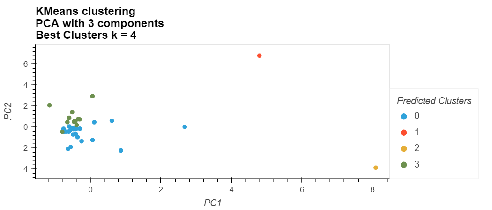

# Grouping Crypto Currencies by Price Performance using Unsupervised Learning

> Using K-Means Clustering, a selection of crypto currencies are grouped based on price performance over multiple time intervals.



---
## Technologies

This project is written using a ```Jupyter Lab 3.2.1``` notebook running  ```Python 3.7.11```.  The key libary is the ```scikit-learn 1.0.2``` for implementing the KMeans algorithm, the principal component analysis PCA for dimensionality reduction, and the StandardScaler for data normalization.  For plot visualizations,```hvplot 0.7.``` is used for plotting elbow curves and clustering data.

---

## Installation Guide

Before running the application, first install the following packages if you don't already have them installed in your development environment.

```python
  pip install jupyterlab
```
You will also need the PyViz ecosystem, including hvPlot for generating the interactive data visualizations.  The PyViz hvPlot package can be installed using the ```conda install``` command:

```python
conda install -c pyviz hvplot
```
To ensure these packages installed properly, run the following commands in a terminal.  A successful install will provide you with the current version numbers for ```hvplot``` installed on your local machine:
```python
conda list hvplot
```

The scikit-learn libary is automatically installed with the Anaconda installation.  To confirm the install and version number of your scikit-learn libary, run the following command on your command line:
```python
conda list scikit-learn
```
If scikit-learn is not already installed in your environment, run the following in your command line:
```python
pip install -U scikit-learn
```


After a successful installation, ```cd``` into the top folder of the repository.  Then open ```Jupyter Lab``` by typing:
```python
jupyter lab
```

The report and analysis are in the jupyter notebook file named ```crypto_investments.ipynb```.  

---

## Usage

This Jupyter notebook groups a series of cryptocurrencies based on their price performance data over multiple time intervals.  The analysis first normalizes the data set using the StandardScalar method from the scikit-learn library.  The optimal number of k-clusters is found using an Elbow plot.  The data is then reduced to 3 components using principal component analysis PCA and the analysis is re-run.  Comparisons are made between running the KMeans algorithm on the original data set versus the dimensionally reduced set.

To view the jupyter notebook used in this analysis, open up a gitbash or terminal in the top folder of the cloned repository.  Open the ```crypto_investments.ipynb``` file, which should look like the displayed version below:


## Data Sources

The crypto market data used in this report can be found in the Resources directory ```./Resources/crypto_market_data.csv```.  The data is provided by the course materials from a UCBerkeley Fintech Extension program.  

---

## Contributors

The seed code is from the course material from a UCBerkeley Extension program.  This analysis is written and performed by John Gruenewald.<br><br>
For more information, contact **John Gruenewald**:<br>
**e-mail:** [john.h.gruenewald@gmail.com](mailto:john.h.gruenewald@gmail.com)<br> **linked-in:**  [jhgruenewald](https://www.linkedin.com/in/jhgruenewald/)<br>**twitter:**  [@GruenewaldJohn](https://twitter.com/GruenewaldJohn)<br>**medium:**  [@comput99](https://medium.com/@comput99)

---

## License

MIT License

Copyright (c) 2022 John Gruenewald